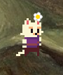
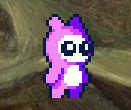
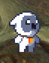
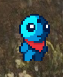
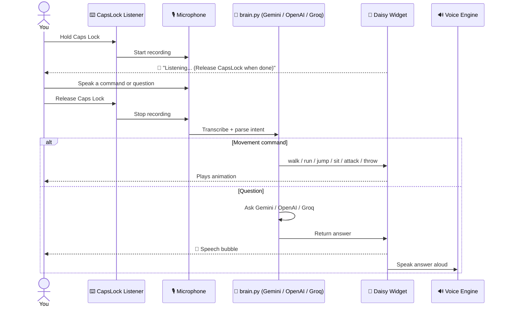
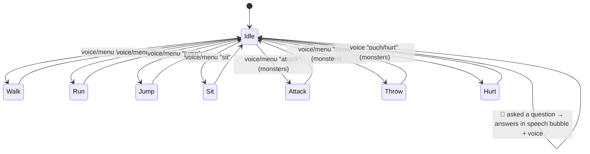

<div align="center">


<br/>

[](https://www.python.org/)
[](https://pypi.org/project/PyQt5/)
[](#)
[](#-setting-your-api-key)
[](#-license)

</div>

<br/>

## 🐾 Meet the Pets

Daisy isn't just one character — pick your favorite companion from the tray menu (or just *tell her* who you want) and she instantly transforms.

<div align="center">

|  |  |  |  |
|:---:|:---:|:---:|:---:|
| **🐱 Daisy (Cat)** | **🌸 Pink Monster** | **🦉 Owlet Monster** | **👾 Dude Monster** |
| Wears her signature daisy flower | Walk · Run · Jump · Sit · Attack · Throw · Hurt | Walk · Run · Jump · Sit · Attack · Throw · Hurt | Walk · Run · Jump · Sit · Attack · Throw · Hurt |

</div>

> Say *"switch to cat"*, *"pink monster"*, *"owlet"*, or *"dude monster"* out loud, or pick one from **🐾 Select Pet** in the right-click menu — she remembers your choice for next time.

<br/>

## 📖 Table of Contents

- [✨ Features](#-features)
- [🧠 How It Works](#-how-it-works)
- [🎮 Controls](#-controls)
- [🗣️ Voice Commands](#️-voice-commands)
- [🚀 Getting Started](#-getting-started)
- [🔑 Setting Your API Key](#-setting-your-api-key)
- [🎀 Daisy's Voice](#-daisys-voice)
- [📦 Building the .exe](#-building-the-exe)
- [🧪 Testing](#-testing)
- [🗂️ Project Structure](#️-project-structure)
- [🛣️ Roadmap](#️-roadmap)
- [🤝 Contributing](#-contributing)

<br/>

## ✨ Features

- 🎤 **Push-to-Talk with CapsLock** — hold **Caps Lock** anywhere on your PC, speak, and release. No window focus needed.
- 🧠 **AI brain** — ask Daisy anything; she answers using **Google Gemini**, **OpenAI**, or **Groq** (free, no card), with automatic provider detection from your key and model fallback chains.
- 🕹️ **Full animation set** — smooth sprite-based **idle, walk, run, jump, sit**, plus **attack, throw & hurt** for the monster pets.
- 🎀 **Cute neural voice replies** — Daisy speaks her answers back using `edge-tts` with 5 selectable "cute girl" voice personas, and falls back to fully offline `pyttsx3` if you're not connected.
- 🐾 **4 selectable pets**, remembered between sessions via a local config file.
- 🖱️ **Full mouse control** — left-click drag to move her, double-click to type a question, middle-click for one-shot voice, right-click for the full menu.
- 🌗 **Time-aware greetings** — she says good morning/afternoon/evening/late-night depending on when you launch her.
- 🔊 **Continuous listening mode** — optionally let her always listen in the background instead of push-to-talk.
- 🪟 **Always-on-top, transparent, frameless** window with a custom pixel font (`Planes_ValMore`) and a speech bubble.
- 📦 **Packaged as a standalone `Daisy.exe`** via PyInstaller — no Python install required for end users.

<br/>

## 🧠 How It Works

<div align="center">



</div>

Daisy's animation states form a simple loop she idles between whenever she isn't mid-command:



<br/>

## 🎮 Controls

| Input | Action |
|---|---|
| 🎙️ **Hold Caps Lock** | Push-to-talk — speak a command or question, release to send |
| 🖱️ **Left-click + drag** | Move Daisy anywhere on your screen |
| 🖱️ **Double-click** | Type a question via dialog box |
| 🖱️ **Middle-click** | One-shot voice listening (3.5s) |
| 🖱️ **Right-click** | Open full menu (pets, actions, voice mode, API key) |
| 🖥️ **Tray icon double-click** | Ask a question |

<br/>

## 🗣️ Voice Commands

<details>
<summary><b>Click to expand the full list of things you can say</b></summary>
<br/>

| Say something like... | Daisy does |
|---|---|
| "run", "sprint", "fast" | 🏃 Runs at high speed |
| "walk", "go", "move", "stroll" | 🐾 Walks at normal speed |
| "jump", "hop", "bounce", "leap" | 🐱 Jumps |
| "sit", "rest", "stop", "freeze", "idle" | 💤 Sits down |
| "attack", "punch", "strike" *(monster pets)* | ⚔️ Attacks |
| "throw", "throw rock" *(monster pets)* | 🪨 Throws a rock |
| "pink monster" / "owlet" / "dude monster" / "cat" | 🔁 Switches active pet |
| "exit", "quit", "close", "bye" | 👋 Says goodbye and closes |
| "what is...", "tell me...", "daisy, ..." or any other phrase | 💬 Sends it to her AI brain as a question |

</details>

<br/>

## 🚀 Getting Started

### 1. Clone & install dependencies

```bash
git clone https://github.com/yourusername/daisy.git
cd daisy

python -m venv venv
venv\Scripts\activate        # Windows
source venv/bin/activate     # macOS/Linux

pip install -r requirements.txt
```

<details>
<summary><b>What's inside requirements.txt?</b></summary>
<br/>

- **PyQt5** — the transparent always-on-top GUI
- **requests** — talks to Gemini / OpenAI / Groq APIs
- **SpeechRecognition**, **sounddevice**, **numpy** — microphone capture & transcription
- **edge-tts**, **soundfile**, **pyttsx3** — cute neural voice + offline fallback speech
- **pywin32** *(Windows only)* — SAPI5 integration for CapsLock detection & TTS

</details>

### 2. Run Daisy

```bash
python main.py
```

She'll spawn near the bottom of your screen and greet you based on the time of day. 🌼

<br/>

## 🔑 Setting Your API Key

Daisy auto-detects whether your key is **Gemini**, **OpenAI**, or **Groq** — just paste it in.

<details open>
<summary><b>Option A — Right inside Daisy (easiest)</b></summary>
<br/>

Right-click Daisy → **"Set API Key (Gemini / OpenAI / Groq)..."** → paste your key → done.

</details>

<details>
<summary><b>Option B — Environment variable</b></summary>
<br/>

**Windows (permanent):**
```powershell
setx GEMINI_API_KEY "your-gemini-key-here"
setx GROQ_API_KEY   "your-groq-key-here"
setx OPENAI_API_KEY "your-openai-key-here"
```

**macOS/Linux:**
```bash
export GEMINI_API_KEY="your-gemini-key-here"
export GROQ_API_KEY="your-groq-key-here"
export OPENAI_API_KEY="your-openai-key-here"
```

</details>

<details>
<summary><b>Where do I get a key?</b></summary>
<br/>

| Provider | Link | Notes |
|---|---|---|
| 🟣 **Groq** *(recommended)* | [console.groq.com/keys](https://console.groq.com/keys) | Free, no card, no billing setup |
| 🔵 **Google Gemini** | [aistudio.google.com/apikey](https://aistudio.google.com/apikey) | Free tier; some projects hit Google's access review |
| 🟢 **OpenAI** | [platform.openai.com/api-keys](https://platform.openai.com/api-keys) | Requires a payment method on file |

Force a specific provider with `DAISY_PROVIDER=gemini|openai|groq`, or override the model with `DAISY_GEMINI_MODEL`, `DAISY_OPENAI_MODEL`, or `DAISY_GROQ_MODEL`.

</details>

<br/>

## 🎀 Daisy's Voice

Right-click Daisy → **Daisy's Voice** to pick her personality:

| Voice | Vibe |
|---|---|
| 🌸 **Ana** *(default)* | Super cute & playful |
| 🎀 **Jenny** | Warm & cheerful |
| ✨ **Emma** | Sweet & bubbly |
| 🌷 **Maisie** | Cute British accent |
| 💖 **Ava** | Soft & gentle |

Powered by `edge-tts` neural voices with tuned pitch/rate — automatically falls back to an offline female `pyttsx3` voice if you're not online.

<br/>

## 📦 Building the .exe

<details>
<summary><b>Package Daisy as a standalone Windows executable</b></summary>
<br/>

```bash
pip install pyinstaller
pyinstaller Daisy.spec
```

This bundles `main.py`, the `Animations/` sprite folder, and `daisy.ico` into a single windowed `Daisy.exe` — no Python required to run it.

</details>

<br/>

## 🧪 Testing

```bash
python -m unittest test_daisy.py -v
```

Covers pet state transitions, speech bubble lifecycle, font loading, and pet persistence.

<br/>

## 🗂️ Project Structure

```
daisy/
├── main.py            # Entry point — wires pet, brain, voice & tray together
├── pet_widget.py       # Transparent widget, sprite animations, mouse events
├── brain.py            # Gemini / OpenAI / Groq Q&A + API key management
├── voice.py            # CapsLock push-to-talk, speech recognition & TTS
├── test_daisy.py        # Unit tests
├── Daisy.spec           # PyInstaller build spec
├── daisy.ico             # App icon
├── Animations/           # Sprite sheets for each pet
│   ├── FreeCatCharacterAnimations/
│   ├── 1 Pink_Monster/
│   ├── 2 Owlet_Monster/
│   └── 3 Dude_Monster/
├── assets/pets/           # README preview images
├── requirements.txt
└── README.md
```

<br/>

## 🛣️ Roadmap

- [ ] Custom hotkey (not just Caps Lock)
- [ ] Sleep animation after idle timeout
- [ ] Short-term conversation memory for follow-up questions
- [ ] Cross-platform push-to-talk (currently Windows-only for CapsLock detection)
- [ ] More pets & community-contributed sprite packs

<br/>

## 🤝 Contributing

Pull requests are welcome! Got a new pet, animation, or voice to add? Open an issue first so we can chat about it.

<br/>

<div align="center">


Made with 🌼 for anyone who wants a chatty little friend on their desktop.

</div>
