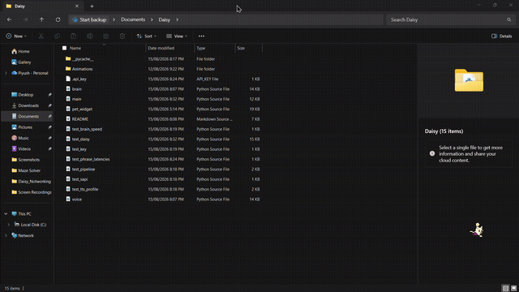
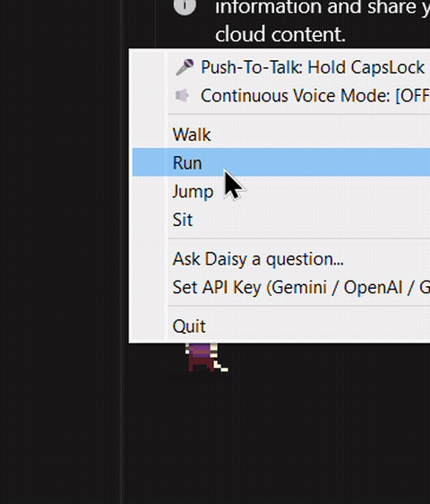
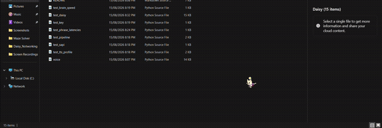

<div align="center">


# 🌼 Daisy — AI Desktop Pet

A small green blob with a flower on her head who lives on your desktop, walks and jumps around, greets you by time of day, listens to voice commands, and answers questions using a free AI provider of your choice (Google Gemini, Groq, or OpenAI).


</div>

---

## 🎬 See Daisy in Action

<table>
<tr>
<td align="center" width="50%">
<br/>
<sub>Daisy strolling around a file explorer window — she doesn't care what's open, she'll wander across it anyway.</sub>
</td>
<td align="center" width="50%">
<br/>
<sub>Right-click for the full menu: push-to-talk, walk/run/jump/sit, ask a question, or set your API key.</sub>
</td>
</tr>
</table>

<p align="center">
<br/>
<sub>A closer look at Daisy's idle, walk, and action animations in real time.</sub>
</p>

---

## Table of Contents

- [Features](#features)
- [Requirements](#requirements)
- [Installation](#installation)
- [Getting an API Key](#getting-an-api-key)
- [Setting the API Key](#setting-the-api-key)
- [Running Daisy](#running-daisy)
- [Controls & Voice Commands](#controls--voice-commands)
- [How It Works](#how-it-works)
- [Project Structure](#project-structure)
- [Environment Variables Reference](#environment-variables-reference)
- [Troubleshooting](#troubleshooting)
- [Running Tests](#running-tests)
- [Extending Daisy](#extending-daisy)
- [Contributing](#contributing)
- [License](#license)

---

## Features


- 🖥️ Transparent, always-on-top desktop companion with sprite-based idle, walk, jump, and sit animations
- 🌅 Greets you with a time-of-day-aware message ("Good morning!", "Good afternoon!", etc.) as soon as she launches
- 💬 Speech bubble UI plus offline text-to-speech (via `pyttsx3`) so she talks back
- 🎤 Push-to-talk voice commands — hold **CapsLock**, speak, and release
- 🧠 AI-powered Q&A backed by **Google Gemini**, **Groq**, or **OpenAI** — auto-detects which provider your key belongs to
- 🖱️ Drag to move, right-click for the full menu, double-click to type a question, middle-click for quick voice input
- 🗂️ System tray icon with the same controls, in case her window gets closed accidentally

<br clear="right"/>

## Requirements

- Python 3.9+
- Windows, macOS, or Linux (voice Push-to-Talk via CapsLock is currently Windows-only; other features are cross-platform)
- A microphone (for voice commands — optional, Daisy still works fully via typed questions without one)
- A free API key from **one** of: Google Gemini, Groq, or OpenAI (see below)

## Installation

```bash
git clone https://github.com/<your-username>/daisy-desktop-pet.git
cd daisy-desktop-pet

python -m venv venv
venv\Scripts\activate        # Windows
source venv/bin/activate     # macOS/Linux

pip install -r requirements.txt
```

## Getting an API Key

Daisy works with any **one** of these three providers — pick whichever is easiest for you:

| Provider | Free tier | Credit card required? | Sign up |
|---|---|---|---|
| **Groq** (recommended) | Yes, generous daily limit | No | https://console.groq.com/keys |
| **Google Gemini** | Yes | No (though some accounts can hit a temporary access review — see [Troubleshooting](#troubleshooting)) | https://aistudio.google.com/apikey |
| **OpenAI** | Pay-as-you-go | **Yes** — billing must be added before any request succeeds, even on the cheapest model | https://platform.openai.com/api-keys |

**Groq** is the most reliable zero-friction option: sign in, click "Create API Key," and you're done — no billing page, no project setup.

## Setting the API Key

**Option A — In Daisy's UI (easiest):**
Right-click Daisy → **"Set API Key (Gemini / OpenAI / Groq)..."** → paste your key → OK. Daisy auto-detects the provider from the key's format (`gsk_...` = Groq, `sk-...` = OpenAI, anything else = Gemini) and saves it to a local `.api_key` file next to `brain.py` so it persists across restarts.

<p align="center">
<br/>
<sub>The right-click menu — "Set API Key" is right there alongside Walk / Run / Jump / Sit.</sub>
</p>

**Option B — As an environment variable:**

```bash
# Windows (persists across sessions)
setx GROQ_API_KEY "your-gsk-key-here"
setx GEMINI_API_KEY "your-gemini-key-here"
setx OPENAI_API_KEY "your-sk-key-here"

# macOS/Linux (current session only, add to your shell profile to persist)
export GROQ_API_KEY="your-gsk-key-here"
export GEMINI_API_KEY="your-gemini-key-here"
export OPENAI_API_KEY="your-sk-key-here"
```

> **Note:** the saved `.api_key` file always takes priority over environment variables. This is intentional — it prevents a forgotten/stale `setx` value from silently overriding a key you set more recently through the UI.

## Running Daisy

```bash
python main.py
```

She'll appear near the bottom-right of your screen and greet you based on the time of day.

## Controls & Voice Commands

| Action | Result |
|---|---|
| **Hold CapsLock** (Push-To-Talk) | Speak a command, release to execute |
| **Middle-click** | Shortcut to trigger voice listening |
| **Right-click** | Open menu (Voice / Walk / Run / Jump / Sit / Ask / Set Key / Quit) |
| **Left-click + drag** | Move Daisy anywhere on screen |
| **Double-click** | Type a question |
| **System tray icon** | Same menu, if her window gets closed |

### Voice Commands (hold CapsLock, speak, release)

- 🏃 **"Run" / "Sprint"** — runs fast across the screen
- 🐾 **"Walk" / "Go" / "Move"** — walks at normal speed
- 🐱 **"Jump" / "Hop" / "Bounce"** — leaps in an arc
- 💤 **"Sit" / "Rest" / "Stop"** — sits and relaxes
- 👋 **"Exit" / "Quit" / "Goodbye"** — says goodbye and closes
- 💬 **"Ask [question]" / "Daisy [question]" / "What is..."** — answers using her AI brain and speaks the reply

<p align="center">

</p>

## How It Works


| File | Responsibility |
|---|---|
| `pet_widget.py` | Transparent always-on-top window; idle/walk/jump/sit animations from sprite sheets; speech bubble and ground shadow rendering |
| `voice.py` | Microphone capture, CapsLock push-to-talk listener, voice command parsing, offline TTS (`pyttsx3`) |
| `brain.py` | Sends questions to Gemini, OpenAI, or Groq (auto-detected from the key), with per-provider model fallback |
| `main.py` | Wires everything together: system tray, right-click menu, voice worker threads, time-of-day greeting on launch |

<br clear="right"/>

<p align="center">
<br/>
<sub>Idle → walk → action, driven straight from the sprite sheets in <code>Animations/</code>.</sub>
</p>

## Project Structure

```
daisy-desktop-pet/
├── main.py            # Entry point — run this
├── pet_widget.py       # Rendering, animation, mouse events
├── brain.py            # AI provider integration (Gemini / OpenAI / Groq)
├── voice.py            # Speech recognition, TTS, push-to-talk
├── test_daisy.py        # Unit tests
├── requirements.txt
├── README.md
├── assets/               # Demo GIFs and images used in this README
└── Animations/          # Sprite sheets (idle, run, jump, fall)
```

## Environment Variables Reference

| Variable | Purpose |
|---|---|
| `GEMINI_API_KEY` / `OPENAI_API_KEY` / `GROQ_API_KEY` | Directly set a specific provider's key |
| `DAISY_API_KEY` | Generic override, provider auto-detected from format |
| `DAISY_PROVIDER` | Force `gemini`, `openai`, or `groq` regardless of key format |
| `DAISY_GEMINI_MODEL` | Override the default Gemini model |
| `DAISY_OPENAI_MODEL` | Override the default OpenAI model (default: `gpt-4o-mini`) |
| `DAISY_GROQ_MODEL` | Override the default Groq model (default: `llama-3.3-70b-versatile`) |

## Troubleshooting

**"API key saved" but Daisy still says invalid key after restarting**
A stale environment variable (e.g. from an old `setx` command) may be shadowing your saved key. Check with `echo %OPENAI_API_KEY%` / `echo %GEMINI_API_KEY%` / `echo %GROQ_API_KEY%` in Command Prompt, and remove any leftover ones via *System Properties → Environment Variables*. (As of the current code, the saved `.api_key` file always takes priority over env vars, so this shouldn't recur once cleaned up.)

**OpenAI: "429 Quota / Rate limit exceeded"**
OpenAI requires a payment method on file even for the cheapest model. Add one at https://platform.openai.com/account/billing, or switch to Groq/Gemini instead — no code changes needed, just paste a different key.

**Gemini: "403 Project access denied"**
This has been reported by multiple users on Google's own developer forum as a project-level access restriction unrelated to your setup — it isn't fixed by creating a new project, enabling the API, or adding billing. If you hit this, either wait for Google to resolve it, request a manual review on their forum (discuss.ai.google.dev), or switch to Groq, which doesn't use Google's project/billing system.

**No sound from voice commands**
Confirm a working microphone is set as your system default input device, and that `sounddevice`/`PortAudio` installed correctly (`pip install sounddevice` should pull in prebuilt binaries on most platforms).

## Running Tests

```bash
python -m unittest test_daisy -v
```

## Extending Daisy

Ideas for next steps, roughly in order of effort:

1. **More states** — "sleep" after N minutes idle, "eat" on file drag, a startup "wave"
2. **Global hotkey** — bind a key combo to summon her without right-clicking
3. **Neural TTS voice** — swap `pyttsx3` for a free neural voice engine (e.g. `edge-tts`) for a less robotic, more expressive voice
4. **Cross-platform Push-to-Talk** — CapsLock detection currently only works on Windows; add macOS/Linux support
5. **Memory** — keep a short conversation history so follow-up questions have context

## Contributing

Pull requests welcome. Please run the test suite before submitting, and keep new features behind sensible defaults so Daisy stays lightweight.

## License

MIT — see `LICENSE` for details.

---

<div align="center">


<sub>Made with 🌼 — a tiny desktop companion that just wants to walk around and answer your questions.</sub>

</div>
